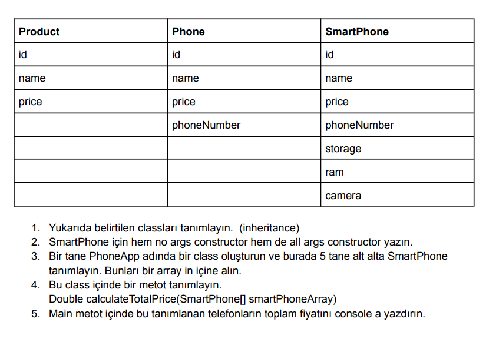

**GarantiBBVA Becoder BootCamp Week 2 Homework**

1. Define the classes mentioned above. (inheritance)
2. Type both no args constructor and all args constructor for the SmartPhone.
3. Create a class called PhoneApp and there are 5 SmartPhones one below the other. define it. Put them in an array.
4. Define a method in this class.  
   Double calculateTotalPrice(SmartPhone[] smartPhoneArray)
6. Print the total price of the phones defined in the Main method to the console.